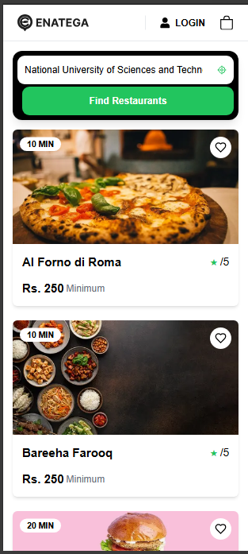
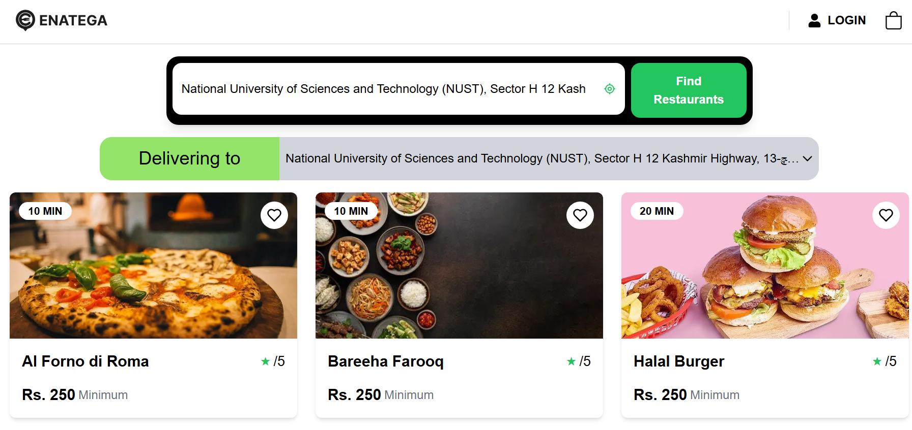

# Full Stack Development Task at Ninja Code

## Introduction

The **Enatega** multi-vendor food delivery solution is designed to provide a user-friendly platform for the food delivery and logistics business. It allows multiple restaurants to list their services and deliver to different locations, similar to popular platforms like Foodpanda and Uber Eats.

## Date and Time of Submission
- **Date**: 18 / 2 / 25
- **Name**: Muhammad Momin Rauf

## Project Details

The **Enatega** platform allows users to search for nearby restaurants, select their delivery location, and view restaurant details dynamically. The platform is built using modern technologies and follows a modular component structure for better scalability.

## Tools and Technologies
- **Next.js 14**
- **PrimeReact**
- **Apollo Client**
- **GraphQL** (for querying restaurant data)
- **OpenCage API** (for location services)

## UI





## Components Overview

### 1. Header Component

| **Feature**        | **Details**                                                                                              |
|--------------------|----------------------------------------------------------------------------------------------------------|
| **Hooks**          | `useState`                                                                                               |
| **Logic**          | - Manages the selected location using `useState`.<br>- Renders navigation elements like Logo, Login button, and Cart icon. |

```javascript
// Example of header component logic
const [location, setLocation] = useState('');
const handleLogin = () => { /* Login logic */ };


'use client';

import Image from 'next/image';
import { Button } from 'primereact/button';
import { Dropdown } from 'primereact/dropdown';
import { useState } from 'react';
import { BsBag } from 'react-icons/bs';
import { FaUser } from 'react-icons/fa';

const locations = [
  { label: 'Berlin, Germany', value: 'berlin' },
  { label: 'Paris, France', value: 'paris' },
  { label: 'New York, USA', value: 'newyork' },
];

export default function Header() {
  const [selectedLocation, setSelectedLocation] = useState(locations[0]);

  return (
    <header className="flex items-center justify-between px-6 py-4 border-b border-gray-300 bg-white shadow-md">
      {/* Logo */}
      <div className="flex items-center">
        <Image src="/logo.svg" alt="Logo" width={120} height={40} />
      </div>

      {/* Actions */}
      <div className="flex items-center gap-6 border-l border-gray-300 pl-6">
        <button className="flex items-center gap-2 text-black font-semibold hover:text-gray-600">
          <FaUser size={18} />
          <span className="uppercase">Login</span>
        </button>
        <BsBag size={24} className="cursor-pointer text-black hover:text-gray-600" />
      </div>
    </header>
  );
}
```

### 2. Loading Skeleton Component
| **Feature** | **Details** |
|-------------|-------------|
| **Hooks** | `useState` |
| **Logic** | - Displays placeholder skeletons while content is loading. |

```javascript
import React from "react";

const LoadingSkeleton = () => {
  return (
    <div className="grid grid-cols-3 gap-4 p-4">
      {/* Skeleton Cards */}
      {[1, 2, 3, 4].map((_, index) => (
        <div
          key={index}
          className="bg-gray-200 animate-pulse rounded-lg p-4 h-40 w-full"
        ></div>
      ))}
    </div>
  );
};

export default LoadingSkeleton;
```

### 3. Location Search Component
| **Feature** | **Details** |
|-------------|-------------|
| **Hooks** | `useState`, `useCallback` |
| **Logic** | - Fetches user's location using `navigator.geolocation`.<br>- Uses OpenCage API for reverse geocoding to get address.<br>- Allows user to search for restaurants near their location. |

```javascript
'use client'
import { useState, useCallback } from "react";
import axios from "axios";
import Image from "next/image";
import { TbCurrentLocation } from "react-icons/tb";
import NearbyResturants from "./NearbyResturants";

const OPENCAGE_API_KEY = "ff949bcce08d459790ed43412e642ccc";

export default function LocationSearch() {
  const [address, setAddress] = useState("");
  const [loading, setLoading] = useState(false);
  const [coordinates, setCoordinates] = useState<{ lat: number | null; lng: number | null }>({
    lat: null,
    lng: null,
  });

  const [fetchTriggered, setFetchTriggered] = useState(false);

  const getCurrentLocation = useCallback(() => {
    if (!navigator.geolocation) {
      alert("Geolocation is not supported by your browser");
      return;
    }

    navigator.geolocation.getCurrentPosition(async (position) => {
      const { latitude, longitude } = position.coords;
      try {
        const response = await axios.get(
          `https://api.opencagedata.com/geocode/v1/json?q=${latitude}+${longitude}&key=${OPENCAGE_API_KEY}`
        );
        const { results } = response.data;
        if (results.length > 0) {
          setAddress(results[0].formatted);
          setCoordinates({ lat: latitude, lng: longitude });
        }
      } catch (error) {
        console.error("Reverse geocoding error:", error);
      }
    });
  }, []);

  const fetchRestaurants = useCallback(() => {
    setFetchTriggered(true);
  }, []);

  return (
    <div className="flex flex-col items-center w-full p-4">
      <div className="relative bg-black h-auto sm:h-[90px] flex flex-col justify-center items-center p-2 rounded-2xl shadow-lg w-full max-w-3xl">
        <div className="md:flex w-[100%] md:flex-row flex flex-col">
          <div className='flex w-full mb-1 flex-row' >
            <input
              type="text"
              placeholder="Enter your address"
              value={address}
              onChange={(e) => setAddress(e.target.value)}
              className="flex-grow p-3 rounded-l-xl focus:outline-none text-black"
            />
            <button
              onClick={getCurrentLocation}
              className="bg-white rounded-r-xl p-3 hover:bg-gray-200 text-black flex items-center justify-center"
            >
              <TbCurrentLocation className="text-green-500" />
            </button>
          </div>
          <button
            onClick={fetchRestaurants}
            className="bg-green-500 rounded-xl ml-2 hover:bg-green-600 text-white font-bold py-3 px-6"
            disabled={loading}
          >
            {loading ? "Searching..." : "Find Restaurants"}
          </button>
        </div>
      </div>

      {coordinates.lat && coordinates.lng && (
        <NearbyResturants coordinates={coordinates} fetchRestaurants={fetchRestaurants} fetchTriggered={fetchTriggered} />
      )}
    </div>
  );
}
```

### 4. Nearby Restaurants Component
| **Feature** | **Details** |
|-------------|-------------|
| **Hooks** | `useState`, `useLazyQuery`, `useEffect`, `useMemo` |
| **Logic** | - Fetches nearby restaurants based on coordinates.<br>- Displays loading skeleton while fetching data.<br>- Passes fetched data to the `RestaurantsGrid` component. |

```javascript
import React, { useState, useCallback, useMemo, useEffect } from "react";
import { useLazyQuery } from "@apollo/client";
import { restaurantQuery } from "../../apollo-config/graphql";
import ResturantsGrid from "./ResturantsGrid";
import LoadingSkeleton from './LoadingSkeleton'

interface NearbyResturantsProps {
  coordinates: { lat: number; lng: number };
  fetchRestaurants: () => void; // Receive fetch function
  fetchTriggered: boolean; // Receive fetch trigger state
}

const NearbyResturants = React.memo(
  ({ coordinates, fetchRestaurants, fetchTriggered }: NearbyResturantsProps) => {
    const [restaurants, setRestaurants] = useState([]);

    const [loading, setLoading] = useState(false);
    const [getRestaurants, { data, error, loading: queryLoading }] = useLazyQuery(restaurantQuery, {
      fetchPolicy: "network-only",
      onCompleted: (data) => {
        setRestaurants(data?.nearByRestaurants?.restaurants || []);
        setLoading(false);
      },
      onError: () => {
        setLoading(false);
      },
    });

    const triggerFetch = useCallback(() => {
      if (fetchTriggered) {
        getRestaurants({
          variables: {
            latitude: coordinates.lat,
            longitude: coordinates.lng,
          },
        });
      }
    }, [fetchTriggered, coordinates.lat, coordinates.lng, getRestaurants]);

    useEffect(() => {
      triggerFetch();
    }, [triggerFetch]);

    const memoizedRestaurants = useMemo(() => restaurants, [restaurants]);

    if (error) {
      console.error("Error fetching restaurants:", error);
      return <p className="text-red-500">Error: {error.message}</p>;
    }

    return (
      <div>
        {loading ? (
          <LoadingSkeleton />
        ) : (
          <div className="mt-4">
            {fetchTriggered && <ResturantsGrid restaurants={memoizedRestaurants} />}
          </div>
        )}
      </div>
    );
  }
);

export default NearbyResturants;
```

### 5. Restaurants Grid Component
| **Feature** | **Details** |
|-------------|-------------|
| **Hooks** | `useState` |
| **Logic** | - Displays restaurants in a grid layout.<br>- Shows restaurant details such as delivery time, minimum order, and categories.<br>- Renders image and dynamic restaurant details. |

```javascript
import React from "react";
import Image from "next/image";

const RestaurantsGrid = ({ restaurants }) => {
  return (
    <div className="grid grid-cols-1 sm:grid-cols-2 lg:grid-cols-3 xl:grid-cols-4 gap-6">
      {restaurants.map((restaurant, index) => (
        <div
          key={index}
          className="bg-white rounded-xl shadow-lg p-4 flex flex-col items-center"
        >
          <Image
            src={restaurant.imageUrl}
            alt={restaurant.name}
            width={300}
            height={200}
            className="rounded-lg w-full h-48 object-cover"
          />
          <h3 className="text-lg font-semibold mt-3">{restaurant.name}</h3>
          <p className="text-sm text-gray-600 mt-1">{restaurant.description}</p>
          <div className="flex gap-2 mt-4">
            <span className="bg-green-500 text-white text-xs px-2 py-1 rounded-full">
              {restaurant.deliveryTime} mins
            </span>
            <span className="bg-yellow-500 text-white text-xs px-2 py-1 rounded-full">
              Min Order: ${restaurant.minOrder}
            </span>
          </div>
        </div>
      ))}
    </div>
  );
};

export default RestaurantsGrid;
```

## Conclusion

The **Enatega** platform enables users to explore various restaurants and easily access their services with smooth

 navigation and dynamic restaurant data. The project leverages modern web technologies such as Next.js, React, and GraphQL to deliver an efficient and responsive user experience.
```

Feel free to modify or add more details depending on your specific requirements.
